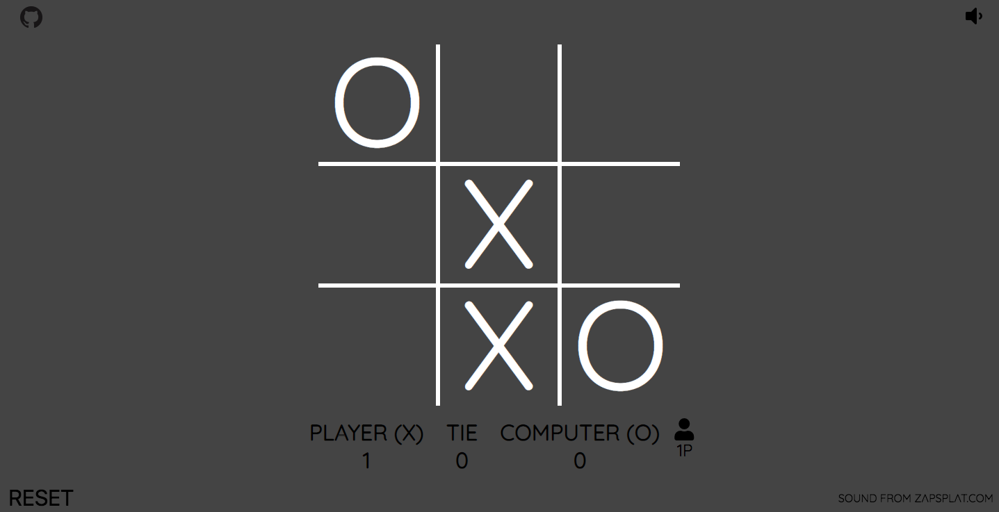

# Tic-Tac-Toe

## General Information:
This project was complete following The Odin Project's [curriculum](https://www.theodinproject.com/courses/javascript/lessons/tic-tac-toe-javascript?ref=lnav).

## Screenshot:

## Technologies:
- HTML
- CSS
- Vanilla Javascript

## Setup: 
The live version of the webpage can be seen [here](https://tpsst5.github.io/tic-tac-toe/).
## Status:
This project is complete.
